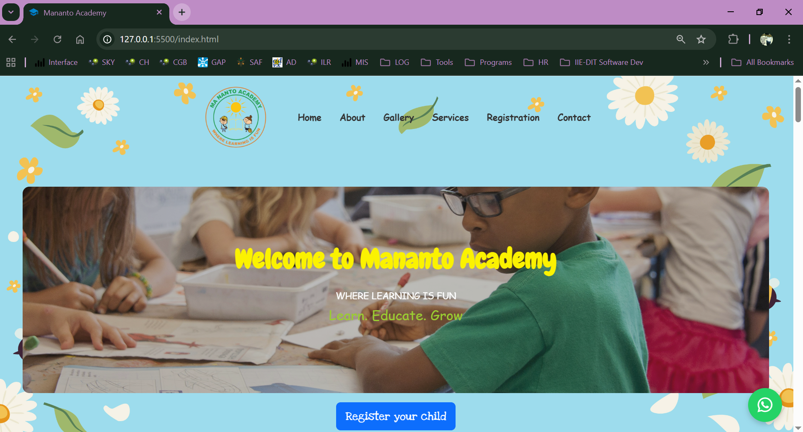
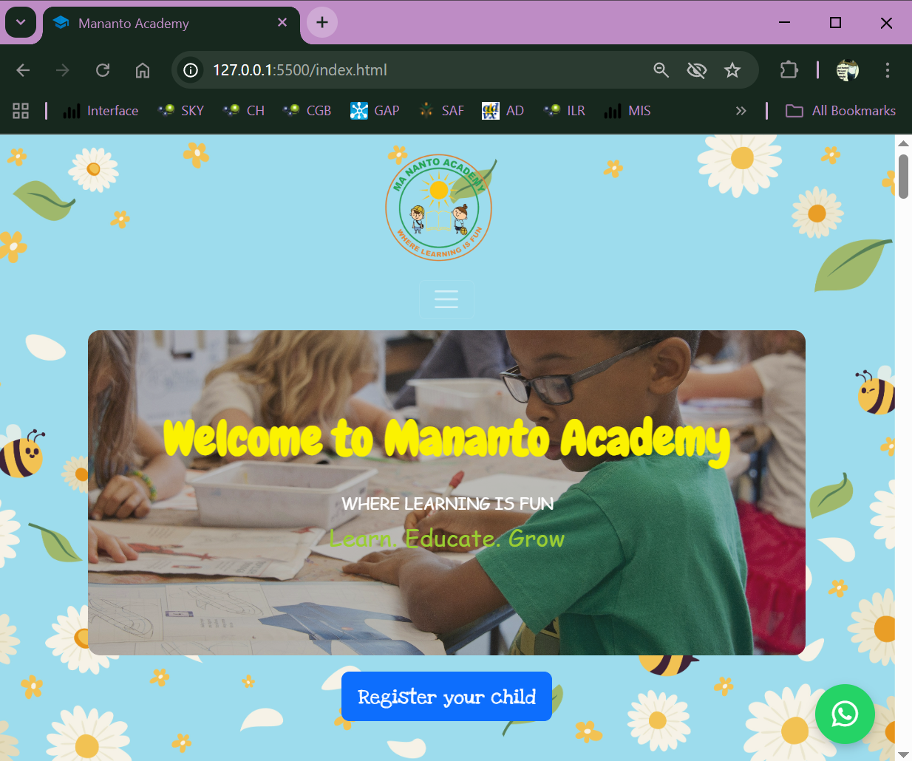
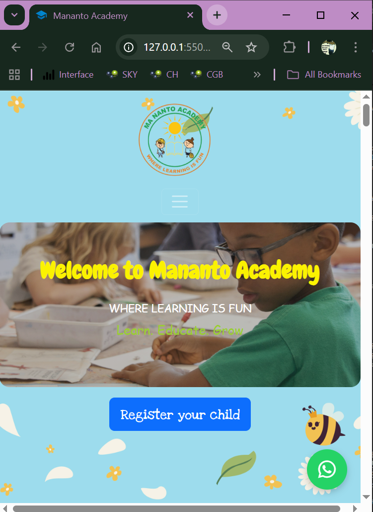

# Project: Website Enhancement for Education Organisation

<h2><u>Part 1</u></h2>
This project aims to upgrade and enhance the existing website of an organisation operating in the Education sector.

### The primary objectives are:

- **Improved User Experience (UX):** Introduce a more dynamic and functionally engaging design that minimizes excessive scrolling on the main page.  
- **Modern Look & Feel:** Refurbish the site with a refreshed colour theme that is visually appealing and aligns with the organisation’s brand.  
- **Mobile-First Approach:** Apply simplicity and responsive design principles to ensure a seamless user experience across all devices.  
- **Increased Conversions:** Optimise the site’s layout and navigation to support higher user engagement and drive more registrations through the website.

### Future Development

In later phases, additional features will be integrated, including:
- PHP-based components such as online payments
- Learner portals for streamlined interaction with students and staff
At this stage, the focus is on delivering a complete visual and functional makeover of the current website.

## Part 2: Project Updates & Enhancements  

# Changelog  

All notable changes to this project will be documented in this file.  
This project follows [Semantic Versioning](https://semver.org/) (MAJOR.MINOR.PATCH).  

---

## [v1.0.0] - 2025-09-15  
- Project setup completed.  
- Basic page structure (Home, About, Gallery, Services, Registration, Contact).  
- Initial wireframes created.  
- Added basic Bootstrap layout and styling.  

---

## [v1.1.0] - 2025-09-25  
- Updated project timeframe.  
- Refined wireframes for all pages.  
- Applied dynamic and playful preschool styling.  
- Introduced new typography and visual style guide.  
- Added responsive techniques for forms and images.  

---

## [v1.2.0] - 2025-10-01  
- Added new Media pages to showcase events.  
- Captured screenshots at different screen sizes for testing.  
- Tested across multiple browsers (Chrome, Edge, Firefox, Safari).  
- Verified responsive behavior and cross-device compatibility.  

---

## [v1.3.0] - 2025-10-03  
- Improved accessibility (color contrast, font sizes, form labels).  
- Added hover states and animations for playful interactions.  
- Enhanced footer with social links and contact information.  

---

## [Unreleased] - Planned  
- Add blog/news section for updates.  
- Create parent portal with login for progress tracking.  
- Add interactive learning games or quizzes.  
- Optimize performance with lazy loading and image compression.  
- Expand accessibility support (screen readers, multi-language support).  

---

### Project Timeframe  
- Adjusted and finalized to reflect the current development progress.  
- Incorporated milestones for design, development, and testing phases.  

### Wireframes  
- Updated wireframes for each page (Home, About, Gallery, Services, Registration, Contact, and Media pages).  
- Ensured alignment with the final playful and child-friendly theme.  

### Styling & Visual Identity  
- Applied dynamic and playful styling suitable for a pre-school audience.  
- Integrated consistent typography choices to enhance readability and engagement.  
- Used visual styles (color palettes, icons, and shapes) to create a vibrant, welcoming look.  

### Responsiveness & Accessibility  
- Implemented responsive techniques for forms, images, and layouts.  
- Ensured cross-device usability (mobile, tablet, desktop).  
- Verified accessibility best practices (contrast, font sizing, and form labels).  

### New Features  
- Added dedicated Media Pages showcasing school events and activities.  
- Integrated icons and playful animations for engagement.  

### Testing & Validation  
- Captured screenshots across different screen sizes to validate responsive design.  
- Tested in multiple browsers (Chrome, Edge, Firefox, Safari) to confirm consistent behavior. 

### Future Development  
- Add a blog/news section for regular updates.  
- Implement a parent portal with login for progress tracking.  
- Introduce interactive elements such as quizzes or learning games.  
- Improve performance with image optimization and lazy loading.  
- Expand accessibility support for screen readers and multi-language options.  

### References

Bootstrap Icons. (2025). Icon pack [Icon set]. https://icons.getbootstrap.com/  
Canva. (2025). Pre-school education images [Images]. Canva. https://www.canva.com/  
Domains.co.za. (n.d.). Web hosting South Africa. https://www.domains.co.za/web-hosting-south-africa  
Favicon.io. (2025). Favicon generator [Tool]. https://favicon.io/  
Friend, N. (2025). Tree [Folder structure diagram generator]. https://tree.nathanfriend.com/  
GitHub. (2025). WEDE5020_PoE [Source code]. GitHub. https://github.com/13wealth/WEDE5020_PoE  
Mananto Academy. (2025). School logo [Image]. Mananto Academy Website. https://www.manantoacademy.co.za  
OpenAI. (2025). ChatGPT (GPT-5) [Large language model]. https://chat.openai.com/  
Stack Overflow. (n.d.). JavaScript DOM manipulation answers. https://stackoverflow.com/  
Wireframe.cc. (2025). Homepage wireframe for Mananto Academy. Wireframe.cc. https://wireframe.cc/pro/editor/966511  

